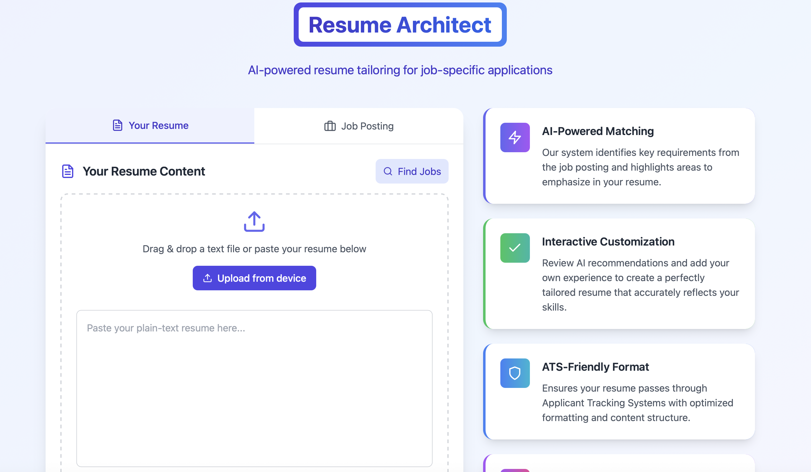
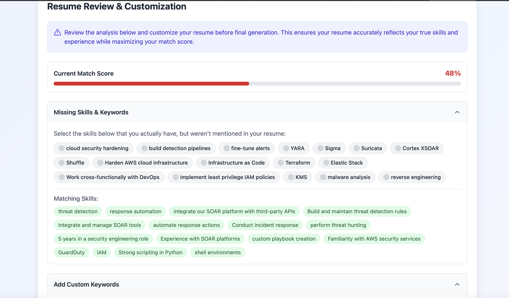
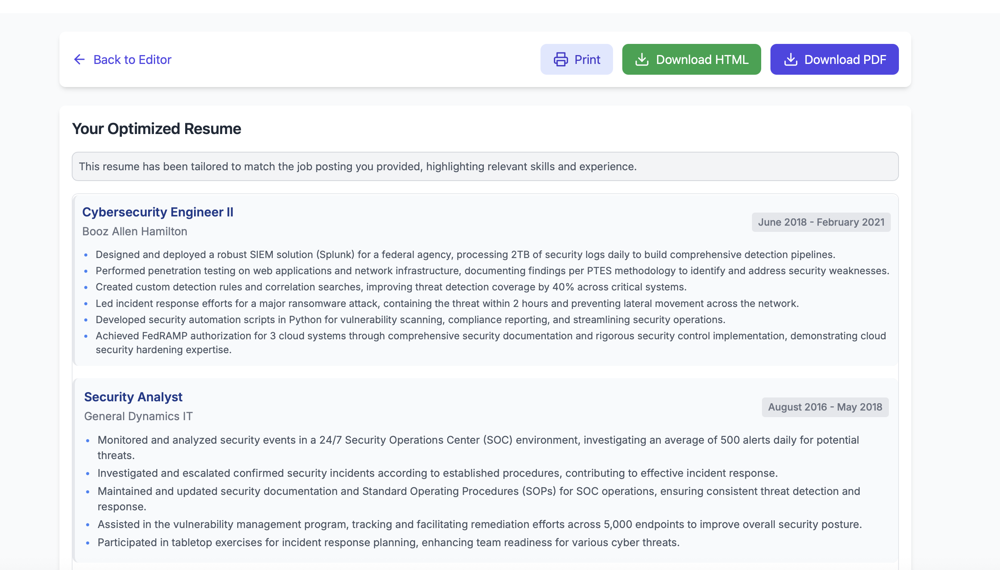

# Resume Architect

AI-powered resume tailoring for job-specific applications. Paste your resume and a job posting, get an optimized resume with matching keywords and ATS-friendly formatting.



## Quick Start (3 Steps)

### Prerequisites
- [Docker Desktop](https://www.docker.com/products/docker-desktop/) installed and running
- A free API key from one of these providers:
  - [Google AI Studio](https://aistudio.google.com/apikey) (Gemini) - recommended
  - [OpenAI](https://platform.openai.com/api-keys)
  - [Anthropic](https://console.anthropic.com/)

### Step 1: Clone and enter the project
```bash
git clone https://github.com/andrewwarz/resume_architect.git
cd resume_architect
```

### Step 2: Create your `.env` file
```bash
cat > .env << 'EOF'
# Choose ONE of these API keys (uncomment the one you have):

# Google Gemini (recommended - free tier available)
GEMINI_API_KEY=your_key_here

# OpenAI
# OPENAI_API_KEY=your_key_here

# Anthropic Claude
# ANTHROPIC_API_KEY=your_key_here

# Model configuration (defaults work great, customize if needed)
LLM_MODEL_OPTIMIZE=gemini/gemini-2.5-flash
LLM_MODEL_ANALYZE=gemini/gemini-2.5-flash
EOF
```

Then edit `.env` and replace `your_key_here` with your actual API key.

### Step 3: Start the app
```bash
docker-compose up -d
```

### Open in your browser

**http://localhost**

That's it! No login required. Start optimizing your resume immediately.

---

## How It Works

1. **Paste your resume** - Upload a file or paste plain text
2. **Add a job posting** - Copy/paste the job description you're applying for
3. **Review the analysis** - See your match score and missing keywords
4. **Select your skills** - Check off skills you have that weren't in your resume
5. **Download** - Get your optimized resume as PDF or HTML





---

## Features

- **AI-Powered Matching** - Identifies key requirements and optimizes your resume
- **Match Score** - See how well your resume matches before and after optimization
- **Keyword Detection** - Highlights missing skills and lets you add ones you have
- **ATS-Friendly** - Formatting designed to pass Applicant Tracking Systems
- **PDF Export** - Professional PDF generation with proper fonts
- **Job Search** - Built-in job search to find relevant positions
- **100% Local** - Your data never leaves your machine
- **No Account Required** - Just start using it

---

## Supported AI Providers

| Provider | Model Example | Environment Variable |
|----------|---------------|---------------------|
| Google Gemini | `gemini/gemini-2.5-flash` | `GEMINI_API_KEY` |
| OpenAI | `gpt-4o`, `gpt-4o-mini` | `OPENAI_API_KEY` |
| Anthropic | `claude-3-5-sonnet-20241022` | `ANTHROPIC_API_KEY` |
| Ollama (local) | `ollama/llama3.2` | `OLLAMA_API_BASE=http://host.docker.internal:11434` |
| OpenRouter | `openrouter/anthropic/claude-3.5-sonnet` | `OPENROUTER_API_KEY` |

Configure models in `.env`:
```bash
LLM_MODEL_OPTIMIZE=gpt-4o          # Used for resume optimization (needs quality)
LLM_MODEL_ANALYZE=gpt-4o-mini      # Used for match analysis (can be faster/cheaper)
```

---

## Troubleshooting

### "Cannot connect to Docker daemon"
Make sure Docker Desktop is running.

### App won't load at http://localhost
```bash
# Check if containers are running
docker-compose ps

# View logs for errors
docker-compose logs

# Restart everything
docker-compose down && docker-compose up -d
```

### API errors / "Invalid API key"
- Verify your API key is correct in `.env`
- Make sure you uncommented the right provider line
- Restart after changing `.env`: `docker-compose down && docker-compose up -d`

### PDF download not working
The Gotenberg service handles PDF generation. Check it's running:
```bash
docker-compose logs gotenberg
```

---

## Local Development (Without Docker)

If you prefer to run without Docker:

### Backend
```bash
cd backend
python3 -m venv venv
source venv/bin/activate  # Windows: venv\Scripts\activate
pip install -r requirements.txt
export GEMINI_API_KEY=your_key_here  # Windows: set GEMINI_API_KEY=your_key_here
uvicorn app:app --reload --port 8000
```

### Frontend
```bash
cd frontend
npm install
npm start
```

Access at http://localhost:3000

**Note:** PDF generation requires Gotenberg running separately:
```bash
docker run -p 3000:3000 gotenberg/gotenberg:8
```

---

## Project Structure

```
resume_architect/
├── backend/                 # FastAPI Python backend
│   ├── app.py              # API routes
│   ├── llm_client.py       # AI provider integration (LiteLLM)
│   ├── resume_processor.py # Resume optimization logic
│   ├── html_generator.py   # HTML resume generation
│   └── pdf_generator.py    # PDF generation via Gotenberg
├── frontend/               # React TypeScript frontend
│   └── src/components/     # UI components
├── docker-compose.yml      # Container orchestration
└── .env                    # Your API keys (create this)
```

---

## API Documentation

When running, interactive API docs are available at:
- http://localhost:8000/docs (Swagger UI)
- http://localhost:8000/redoc (ReDoc)

---

## License

MIT
